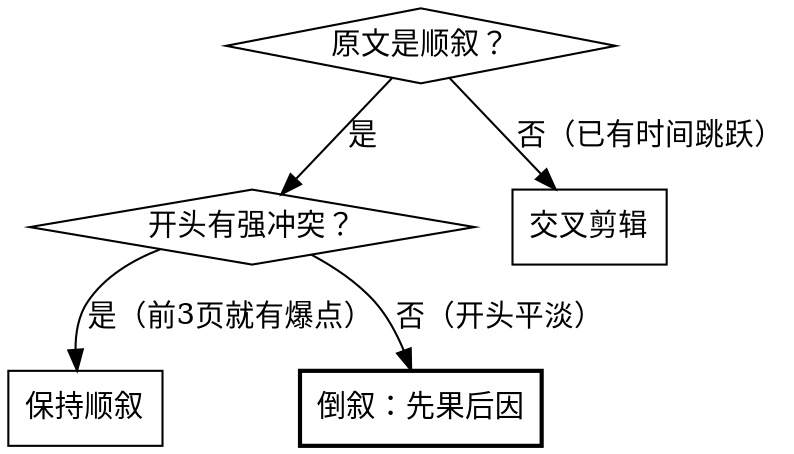
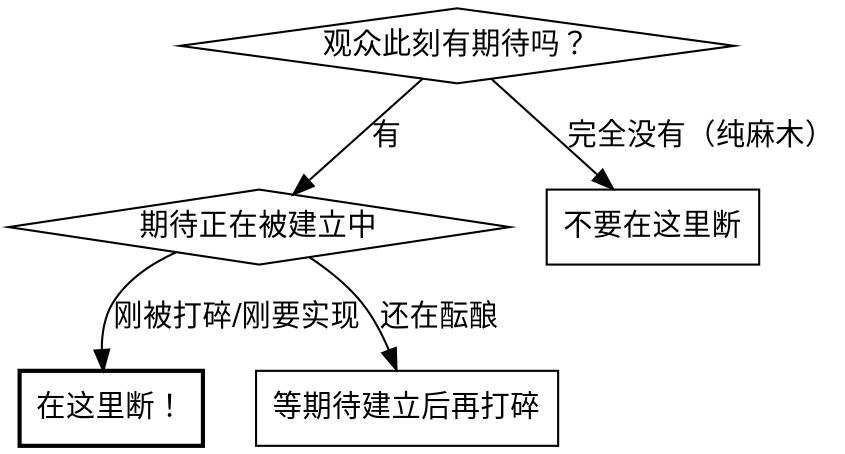

# 小说转短剧编剧 (Novel-to-Short-Drama Adaptation)

## Overview

将小说文本转化为具有电影感的短剧剧本。核心原则：**每一秒都要有张力或推进，用视听语言替代文字叙述，用结构制造悬念而非平铺直叙。**

本 skill 设计为**交互式协作流程**——AI 扮演专业编剧，引导用户（原著分析师/小说读者/制片人）逐步完成从原文到分镜的全过程。

**前置依赖：** 建议先使用 `story:extract` 完成原文梗概提取，获得结构化的人物图谱、角色心理模型、事件链、伏笔网和吸引力内核分析，再进入本 skill 进行改编。

## When to Use

- 用户已有梗概提取结果或原文素材，需要改编为短剧剧本
- 用户需要设计单集的幕式结构、镜头语言、叙事钩子
- 用户需要设计角色的表演方向和视觉化表达
- 用户有会议纪要/讨论记录，需要整理为规范剧本格式
- 用户需要分析原著素材的戏剧冲突点和改编取舍

**When NOT to use:**
- 长剧集（单集 >10 分钟）的剧本创作
- 原创剧本（无原著素材）
- 纯文学分析（不涉及视觉化改编）——用 `story:extract`

## Phase 0: 改编参数确认（首要步骤）

开始改编前，**必须与用户确认以下参数**（或从素材中推断并请用户确认）：

### 品类与基调

| 参数 | 选项 | 影响范围 |
|------|------|---------|
| **核心品类** | 言情/悬疑/逆袭/玄幻/喜剧/恐怖/混合 | 驱动力选择、节奏设计 |
| **情绪基调** | 虐/甜/燃/爽/恐/笑 | 配乐/色调/表演风格 |
| **目标受众** | 女性向/男性向/通用 | POV策略、共情锚点 |

### POV 策略选择

| 策略 | 适用场景 | 规则 | 典型品类 |
|------|---------|------|---------|
| **单一女性POV** | 女性向情感故事 | 只有女主 OS；男主情感只通过外部行为传达 | 甜宠/虐恋/霸总 |
| **单一男性POV** | 男性向逆袭/战神故事 | 只有男主 OS；其他角色只通过行为传达 | 战神归来/赘婿/重生复仇 |
| **交替POV** | 双强/双视角故事 | 集与集交替，**同一集内不切换**；切换时用明确的视觉标记 | 悬疑对决/双强 CP |
| **全知受限** | 群像/纯悬疑 | 无 OS，全靠行为+声音+镜头；观众视角=摄像机视角 | 推理/恐怖/群像剧 |
| **上帝视角** | 信息差最大化的故事 | 观众知道所有角色都不知道的信息，用全知画外音 | 阴谋/命运交错 |

**确认后写入剧本头部，全集严格遵守，不得中途切换。**

### 时长与结构选择

| 单集时长 | 推荐幕数 | 结构说明 |
|---------|---------|---------|
| **60-90秒** | 2幕+钩子 | 极致压缩，一个核心信息+一个悬念引擎 |
| **2-3分钟** | 3幕+钩子 | 标准短剧，允许一条 B 故事线 |
| **5-8分钟** | 4-5幕 | 微短剧，允许完整起承转合+副线展开 |

---

## 协作流程

```dot
digraph adaptation_flow {
    rankdir=TB;
    node [shape=box];

    "Phase 0: 参数确认" [shape=doublecircle];
    "Phase 1: 原文解剖" [shape=doublecircle];
    "提取冲突核心" [label="提取冲突核心\n(谁在痛/谁在危/谁在变？)"];
    "标记可视化锚点" [label="标记可视化锚点\n(哪些能拍？哪些要转化？)"];
    "Phase 2: 结构设计" [shape=doublecircle];
    "选择时间线策略" [label="选择时间线\n(倒叙/顺叙/交叉)"];
    "确定幕式结构" [label="确定幕数与节奏\n(每幕的功能是什么？)"];
    "Phase 3: 场景构建" [shape=doublecircle];
    "逐幕设计" [label="逐幕构建\n(镜头+台词+声音+表演)"];
    "碰撞设计" [label="碰撞点设计\n(多元素同时爆发)"];
    "Phase 4: 钩子锻造" [shape=doublecircle];
    "悬念分层" [label="悬念分层\n(逻辑/情感/道具)"];
    "断点选择" [label="断在最痛/最悬处"];
    "输出: 分镜剧本" [shape=doublecircle];

    "Phase 0: 参数确认" -> "Phase 1: 原文解剖";
    "Phase 1: 原文解剖" -> "提取冲突核心";
    "提取冲突核心" -> "标记可视化锚点";
    "标记可视化锚点" -> "Phase 2: 结构设计";
    "Phase 2: 结构设计" -> "选择时间线策略";
    "选择时间线策略" -> "确定幕式结构";
    "确定幕式结构" -> "Phase 3: 场景构建";
    "Phase 3: 场景构建" -> "逐幕设计";
    "逐幕设计" -> "碰撞设计";
    "碰撞设计" -> "Phase 4: 钩子锻造";
    "Phase 4: 钩子锻造" -> "悬念分层";
    "悬念分层" -> "断点选择";
    "断点选择" -> "输出: 分镜剧本";
}
```



---

## Phase 1: 原文解剖

**目标：** 从小说原文中提取可改编的戏剧骨架，丢弃不可拍摄的文字叙述。

### 向用户提问（交互）

根据品类调整核心问题：

| 品类 | 核心问题 |
|------|---------|
| **情感向** | "这段原文中，**谁最痛**？痛的原因是什么？" |
| **悬疑向** | "这段原文中，**什么最可疑**？观众应该先注意到什么？" |
| **爽感向** | "这段原文中，**谁最该被碾压**？碾压的爽点是什么？" |
| **通用** | "原文中有哪些**已经是画面**的描写？哪些**只存在于文字**？" |

### 编剧操作：文字→视听语言转化

| 原文类型 | 处理方式 | 示例 |
|---------|---------|------|
| 内心独白 | → 旁白/画外音（限 POV 角色）或 → 微表情+动作 | "她心好疼" → 手指收紧、眼眶泛红 |
| 背景叙述 | → 闪回碎片 或 → 字幕提示 或 → 角色对话带出 | "他们认识四年" → 闪回合照画面 |
| 心理活动 | → 声音设计（心跳/呼吸）或 → 主观镜头 | "大脑一片空白" → 环境音消失、画面失焦 |
| 对话 | → 精炼至每句有戏剧功能，砍掉所有废话 | 十句对话压缩至三句核心台词 |
| 道具描写 | → 升级为叙事道具（贯穿多场景） | 普通礼物 → 跨集线索道具 |
| 力量体系/设定说明 | → 视觉化展示 + 角色反应暗示等级 | "他是金丹期" → 一掌碎石+围观者震惊 |
| 环境描写 | → 服务于情绪的空间叙事 | "荒凉的小镇" → 空旷街道+风吹废纸+远处犬吠 |

### 反平淡检查

对每一段原文问：**"这段如果直接拍出来，观众会快进吗？"**

- 如果会 → 要么砍掉，要么用更强烈的方式重构
- 如果不会 → 保留，进入镜头设计

---

## Phase 2: 结构设计

### 时间线策略选择



**短剧黄金法则：先给冲击，再给原因。** 品类不同，"冲击"的形态不同：

| 品类 | 冲击形态 | 前置什么 |
|------|---------|---------|
| 言情 | 痛感 | 最惨/最虐的画面 |
| 悬疑 | 疑问 | 最诡异/最不合理的现场 |
| 逆袭 | 反差 | 主角被羞辱的极限场面 |
| 恐怖 | 恐惧 | 最令人不安的画面（但不揭示来源） |

### 幕式结构设计

根据 Phase 0 确认的时长选择对应结构：

#### 60-90秒结构（极致压缩）

| 幕 | 时长占比 | 功能 | 情绪曲线 |
|---|:---:|------|---------|
| 第一幕 | 40-45% | **建立冲击**：让观众立刻代入主角的处境 | 高开（冲击） |
| 第二幕 | 30-35% | **揭示成因**：解释为什么会这样，制造信息差 | 沉（压抑/反差） |
| 转场钩子 | 15-20% | **断裂制造**：在希望与绝望的交界处切断 | 骤停（悬念） |

#### 2-3分钟结构（标准短剧）

| 幕 | 时长占比 | 功能 | 情绪曲线 |
|---|:---:|------|---------|
| 第一幕 | 30-35% | **建立冲击 + 世界观锚定** | 高开 |
| 第二幕 | 25-30% | **发展冲突 + 引入 B 线** | 递进 |
| 第三幕 | 20-25% | **转折/揭示** | 反转 |
| 转场钩子 | 10-15% | **悬念断裂** | 骤停 |

#### 5-8分钟结构（微短剧）

| 幕 | 时长占比 | 功能 | 情绪曲线 |
|---|:---:|------|---------|
| 第一幕 | 20-25% | **起：建立世界+冲突种子** | 铺垫→小钩 |
| 第二幕 | 20-25% | **承：发展冲突，角色选择** | 递进 |
| 第三幕 | 20-25% | **转：信息揭示/反转** | 突变 |
| 第四幕 | 15-20% | **合：收束本集线索** | 收 |
| 转场钩子 | 10-15% | **悬念断裂** | 骤停 |

### 每幕必须回答的问题

- 这一幕的**唯一核心信息**是什么？（只能有一个）
- 这一幕结束时，观众的**情绪状态**应该是什么？
- 这一幕与上一幕之间的**温度反差**是什么？

---

## Phase 3: 场景构建

### 逐幕构建法（交互式）

对每一幕，与用户按以下顺序讨论：

**Step 1: 空间选择**
> "这场戏发生在什么空间？空间本身在说什么话？"
> （救护车=紧迫；书房=距离感；废弃工厂=危险/隐秘；擂台=对决/公开）

**Step 2: 镜头语言设计**

| 镜头类型 | 叙事功能 | 使用场景 |
|---------|---------|---------|
| 特写 | 情绪放大、细节揭示 | 眼泪、手指收紧、道具、线索 |
| 近景 | 角色状态、对话 | 两人对手戏、独白 |
| 中景 | 空间关系、身体语言 | 走廊中的背影、对峙 |
| 全景 | 环境叙事、孤独感/壮观感 | 空旷书房中对坐、战场全貌 |
| 主观镜头 | 代入感、意识状态 | 模糊视线、天花板掠过、偷窥视角 |
| 闪回碎片 | 记忆、伏笔、时间跳跃 | 黑白快切+音效触发 |
| 跟拍/手持 | 紧张感、失控感 | 追逐、恐慌、混乱场景 |

**Step 3: 声音设计**

声音是短剧中**被严重低估的叙事工具**：

| 声音元素 | 叙事功能 | 示例 |
|---------|---------|------|
| 心跳声 | 生死感、紧张度控制 | 渐弱=意识消失，骤强=觉醒 |
| 环境音消失 | 主观孤立感 | 角色大脑空白时的"寂静" |
| 声音先导 | 转场过渡 | 先听到茶杯声，再看到画面 |
| 音效断裂 | 戛然而止的冲击 | 结尾一切声音突然切断 |
| 手机铃声 | 外力介入/打破状态 | 关键时刻来电 |
| 环境音失真 | 恐惧/异常暗示 | 正常声音变低沉/变调 |
| 脚步声节奏 | 紧迫感递进 | 越来越快=追逐；突然停止=转角 |

**Step 4: 台词精炼**

每句台词必须通过**三重检验**：
1. **信息功能**：这句话推进了剧情吗？
2. **情感功能**：这句话改变了角色或观众的情绪吗？
3. **不可替代性**：删掉这句话，场景还能成立吗？

三项都不满足 → 删除。只满足一项 → 考虑用表情/动作替代。

**Step 5: 角色表演设计**

> 这一步将 extract 的角色心理模型转化为可拍摄的表演指导。

对每个场景中的每个角色，设计：

| 维度 | 设计要点 | 示例 |
|------|---------|------|
| **此刻的内在状态** | 从角色心理模型推导，此刻角色的欲望/恐惧/面具处于什么状态 | 她想留住他但面具是"我不在乎" |
| **微表情设计** | 面具裂缝在哪里？什么瞬间真实情感泄露？ | 说"随便你"时指尖微颤 |
| **身体语言** | 角色的姿态/动作如何暴露内在冲突 | 背对门口但脚尖朝向门——身体比嘴诚实 |
| **声音质感** | 台词的语气/语速/停顿设计 | "没关系"——声音平稳但最后一个字气息断了 |
| **与空间的关系** | 角色如何使用空间？占据/退缩/控制/游离 | 她始终站在门边=随时准备逃走 |

**核心原则：观众通过观察角色「说的」和「做的」之间的矛盾来感知角色深度。** 言行一致的角色是纸片人，言行矛盾但逻辑自洽的角色是活人。

### 碰撞设计法

**碰撞 = 在一个瞬间内叠加多个戏剧元素，使张力倍增。**

设计步骤：
1. 列出该场景中所有**待释放的信息/情感**
2. 找到一个**物理动作或时刻**作为碰撞点
3. 让 2-3 个元素**同时在这个点爆发**

示例（言情）：
> 碰撞点 = 男主在病房门口的3秒钟
> 元素1：手中的耳环（他还在乎？）
> 元素2：听到"他不是我老公了"（误解触发）
> 元素3：女二来电（外力介入）
> → 三重碰撞 = 一个简单的"站在门口"变成全集最强的情感爆破点

示例（悬疑）：
> 碰撞点 = 探长打开死者抽屉的瞬间
> 元素1：抽屉里有自己二十年前的照片（身份关联）
> 元素2：门外搭档正在汇报排除了内部人员嫌疑（反讽）
> 元素3：照片背面的日期是他声称不在场的那天（自证崩塌）
> → 三重碰撞 = 探长从调查者变成了嫌疑人

示例（逆袭）：
> 碰撞点 = 主角在拍卖会上举牌的瞬间
> 元素1：竞拍对手正是当年羞辱他的前岳父（身份对决）
> 元素2：拍品是他亲手设计却被窃取署名的作品（正义回收）
> 元素3：前妻在旁边看到他出价十倍而震惊（认知颠覆）
> → 三重碰撞 = 一个举牌动作完成复仇+正名+反差揭示

---

## Phase 4: 钩子锻造

### 悬念三层模型

| 层次 | 类型 | 驱动力 | 示例（言情） | 示例（悬疑） | 示例（逆袭） |
|------|------|-------|------------|------------|------------|
| 第一层 | **逻辑悬念** | "怎么回事？" | 契约婚姻怎么会怀孕？ | 死者手里为什么握着凶手的信物？ | 一个乞丐怎么有黑卡？ |
| 第二层 | **情感悬念** | "太[虐/恐/燃]了" | 她爱了他十年他居然不知道 | 探长发现凶手可能是自己的儿子 | 他被全家逐出时没人知道他是集团真正的继承人 |
| 第三层 | **道具悬念** | "那个东西呢？" | 翡翠耳环去了哪里？ | 消失的第三把钥匙在谁手上？ | 那份遗嘱的第二页写了什么？ |

**至少两层同时运转**，单集才有足够的留存驱动力。

### 断点选择原则

**根据品类选择最佳断点位置：**

| 品类 | 断在哪里 | 观众心理 |
|------|---------|---------|
| **言情** | 希望刚出现就被碾碎的瞬间 | "不要啊！" → 下一集 |
| **悬疑** | 新线索指向了最不可能的人 | "不会吧？！" → 下一集 |
| **逆袭** | 主角身份即将暴露但还差一步 | "快亮身份啊！" → 下一集 |
| **恐怖** | 威胁刚被确认为真实 | "真的有鬼！" → 下一集 |
| **通用** | 在情绪最高点突然切断（而非情绪谷底） | 利用"蔡格尼克效应"——未完成的事更让人惦记 |



### 结尾表情纪律

钩子中角色的最后一个表情**决定了观众对下一集的期待方向**：

| 表情 | 观众解读 | 适用场景 |
|------|---------|---------|
| 轻蔑一笑 | "这人太坏了" → 观众愤怒驱动 | 反派确实无情的线路 |
| 面无表情+细微动作 | "可能有隐情" → 观众好奇驱动 | 角色后续有反转的线路 |
| 怔然/僵住 | "他被触动了" → 观众期待驱动 | 角色开始动摇的线路 |
| 嘴角微扬（但眼神冷） | "他在布局" → 观众紧张驱动 | 角色在执行计划的线路 |
| 瞳孔骤缩 | "他知道了" → 观众紧迫驱动 | 关键信息刚被获取的线路 |

**选择取决于后续剧情走向**——如果角色后面有大反转，结尾不能把他彻底钉死在单一标签上。

---

## POV 执行纪律

根据 Phase 0 确认的 POV 策略，严格执行对应规则：

### 单一 POV（女主/男主）
- **只能有 POV 角色的内心声音**（旁白/画外音/OS）
- 另一方的情感**只能通过可被观察到的外部行为传达**：微表情、小动作、语气变化、道具处理方式
- 如果需要暗示非 POV 角色的内心，用**小声自言自语**（对方听不到）代替 OS
- 观众知道的信息**不能超过 POV 角色视角能获取的范围**（除非明确标注为全知视角段落）

### 交替 POV
- 每集开头用**视觉标记**（色调/字幕/标志性画面）标明本集 POV 归属
- 同一集内**不切换** POV
- 两集合看时，应能产生"原来那时候他在想这个"的信息差效果

### 全知受限
- **无任何角色 OS**——观众是纯粹的旁观者
- 角色的一切内心活动只能通过外部行为推断
- 镜头成为唯一的"叙事者"——镜头选择看什么、不看什么 = 叙事策略

---

## 输出格式规范

每一集的最终输出应包含：

```markdown
# 《作品名》短剧 · 第X集

> **集数**：第X集
> **时长**：约XX秒/分钟
> **结构**：X幕+钩子
> **叙事视角**：[POV策略]（POV角色：XXX）
> **时间线**：[顺叙/倒叙/交叉]
> **品类/基调**：[品类] / [情绪基调]

---

## 第X幕：[幕名]
> 时间/场景/时长

### 场景描述（环境+氛围）
### 镜头分解表（序号/镜头类型/画面/声音/备注）
### 台词（角色/台词/表演指导）
### 画外音（如有，仅限 POV 角色）
### 角色表演备注（关键角色本幕的内在状态 → 外在表现设计）
### 关键信息释放（本幕释放了什么信息）

---

## 转场钩子：[钩名]
### 镜头分解表
### 钩子信息叠加表（层次/信息/观众心理）

---

## 附录
### 角色信息表（含本集心理状态标注）
### 核心道具表
### 悬念清单
```

---

## 常见错误

| 错误 | 为什么错 | 正确做法 |
|------|---------|---------|
| 照搬小说对话 | 小说对话节奏慢、信息密度低 | 每句台词压缩至有且仅有一个戏剧功能 |
| 多个角色都有内心独白 | 破坏 POV 一致性，观众无法代入 | 严格按 POV 策略执行，非 POV 角色用行为传达 |
| 闪回是随机甜蜜画面 | 空洞回忆杀不推进剧情 | 每个闪回都必须是后续剧情的视觉预埋 |
| 结尾在平静处切断 | 无留存驱动力 | 断在期待刚被建立/打碎的瞬间 |
| 一集塞太多信息 | 短时间无法承载过多线索 | 一集一个核心信息+一个悬念引擎 |
| 设定用台词解释 | 生硬、不自然 | 用视觉暗示+角色反应+侧面提及 |
| 道具随用随丢 | 浪费叙事资源 | 关键道具必须贯穿至少三个场景 |
| 角色表演只写"伤心""愤怒" | 形容词不是表演指导，演员无法执行 | 具体到动作/微表情/声音质感 |
| 所有品类用同一种断点 | 言情断在虐点，悬疑断在疑点，不能混用 | 根据品类选择对应的断点策略 |
| 角色言行完全一致 | 没有内在冲突的角色是纸片人 | 设计"说的"与"做的"之间的裂缝 |
