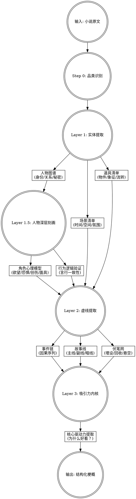

# 小说梗概提取专家 (Story Structure Extraction)

## Overview

从大段小说原文中提取结构化的叙事骨架。核心原则：**先拆实体（看得见的），再拆虚线（看不见的），再拆人物内核（角色为什么活），最后提炼吸引力内核（为什么好看）。**

本 skill 设计为**分层递进式分析**——每一层的输出是下一层的输入，确保不遗漏关键信息。

## When to Use

- 用户提供大段小说/网文原文（通常数千字以上），需要梳理剧情脉络
- 用户需要提取人物关系、场景清单、关键道具等实体信息
- 用户需要深度分析角色心理、行为逻辑、人物弧光
- 用户需要梳理故事线、伏笔、悬念等叙事结构
- 用户需要分析一个故事"为什么吸引人"的核心驱动力
- 作为下游改编工作（短剧、漫画、游戏等）的前置分析

**When NOT to use:**
- 短文本分析（<1000字）——直接阅读即可
- 文学批评/学术论文写作
- 已有完整梗概、只需要改编的场景（用 `story:adapt`）

## 品类识别（首要步骤）

分析开始前，**必须先识别故事的核心品类**，品类决定后续所有分析框架的侧重点：

| 品类 | 典型标志 | 分析侧重 |
|------|---------|---------|
| **言情/甜宠** | 感情线是主轴，男女主纠葛 | 信息差、情感弧、关系矩阵 |
| **悬疑/推理** | 谜题驱动，真相层层揭示 | 线索链、认知拼图、误导分析 |
| **玄幻/修仙** | 等级体系、功法、世界观 | 力量体系、升级节点、世界观规则 |
| **都市/逆袭** | 身份反差、实力碾压 | 身份揭示节奏、打脸链条 |
| **悬疑+言情** | 混合品类 | 按主次线分别用对应框架 |
| **其他** | 喜剧/恐怖/科幻/历史等 | 根据核心冲突类型灵活选择 |

## 分析流程



---

## Layer 1: 实体提取（看得见的）

### 1.1 人物图谱

对每个出场人物提取：

| 字段 | 说明 | 示例（言情） | 示例（悬疑） |
|------|------|------------|------------|
| **姓名** | 全名 + 常用称呼 | 南溪（女主） | 林探长（主视角） |
| **年龄/外貌** | 关键视觉特征 | 27岁，研究生未毕业 | 45岁，左手无名指缺失 |
| **身份标签** | 社会角色（表面 + 真实） | 陆家少奶奶（契约）、孤女 | 退休刑警（表面）、嫌疑人之一（真实） |
| **核心秘密** | 角色隐藏的关键信息 | 暗恋陆见深十年、已怀孕 | 案发当晚在场但未报警 |
| **核心动机** | 角色行为的驱动力 | 想被爱，但不敢开口 | 寻找真凶以洗清自己 |
| **关系网** | 与其他角色的关系及状态 | 与男主：契约夫妻/暗恋 | 与死者：师徒/有恩怨 |

**人物关系矩阵**（交互式输出）：

用矩阵揭示**关系的不对称性**——A 对 B 的认知 ≠ B 对 A 的认知，不对称处 = 戏剧张力来源。

```
        角色A       角色B       角色C       角色D
角色A    —          [A认为的关系]  ...         ...
角色B   [B认为的关系]  —          ...         ...
角色C    ...         ...         —          ...
角色D    ...         ...         ...         —
```

### 1.2 场景清单

对每个出现的场景提取：

| 字段 | 说明 |
|------|------|
| **场景名** | 简短标识 |
| **时间** | 绝对时间（两年前/当天早晨）或相对位置 |
| **空间** | 物理地点 + 空间特征（封闭/开放、冷/暖） |
| **在场人物** | 谁在这个场景中 |
| **氛围关键词** | 3个词概括情绪基调 |
| **核心事件** | 这个场景发生了什么 |

### 1.3 道具清单

只提取**有叙事功能**的物件（出现一次且无后续作用的忽略）：

| 字段 | 说明 |
|------|------|
| **道具名** | 翡翠耳环、密码本、旧照片、断剑 |
| **首次出现** | 哪个场景 |
| **持有者变化** | 从谁手中到谁手中 |
| **象征意义** | 代表什么情感/关系/权力状态 |
| **后续作用** | 是否在后文再次出现、触发新事件 |
| **叙事潜力评级** | ★~★★★（能否升级为贯穿道具） |

---

## Layer 1.5: 人物深层刻画（角色为什么活）

> 这一层是角色从"纸片人"到"活人"的关键。人物图谱只回答了"他是谁"，这一层回答"他为什么是这样的人"。

### 1.5.1 角色心理四层模型

对每个主要角色，提取四层心理结构：

| 层次 | 定义 | 提取方法 | 示例（言情） | 示例（悬疑） | 示例（逆袭） |
|------|------|---------|------------|------------|------------|
| **表层欲望** | 角色嘴上说想要的 | 角色的明确目标/台词 | "我要离婚" | "我要找到凶手" | "我要证明自己" |
| **深层需求** | 角色真正缺失的 | 反推：什么匮乏导致了表层欲望？ | 被无条件爱（从未被爱过） | 被原谅（内疚三十年） | 被认可（一直被否定） |
| **核心恐惧** | 角色最害怕什么 | 角色在回避什么？什么话题让他失控？ | 被抛弃后的孤独 | 真相揭示自己才是帮凶 | 再次失败，证明别人是对的 |
| **心理面具** | 角色展示给外界的假面 | 角色的"表面人设"与真实状态的差距 | 坚强独立（实际极度依赖） | 冷静理性（实际恐惧驱动） | 玩世不恭（实际极度在意） |

**关键检验**：表层欲望 ≠ 深层需求时，角色才有戏。如果一致（他想要钱 + 他真的就缺钱），角色就是扁平的。

### 1.5.2 角色弧光追踪

每个主要角色的**内在变化轨迹**：

```
角色弧光 = 起始状态 → 催化事件 → 抗拒 → 被迫面对 → 蜕变/坠落
```

| 阶段 | 内在状态 | 外在表现 | 触发事件 |
|------|---------|---------|---------|
| **起始** | 角色的默认心理状态 | 角色的习惯性行为模式 | — |
| **催化** | 平衡被打破 | 第一次异常反应 | 什么事件启动了变化？ |
| **抗拒** | 试图维持旧模式 | 否认/逃避/攻击 | 角色如何抵抗变化？ |
| **面对** | 旧模式彻底失效 | 崩溃/暴露/选择 | 什么让他无法继续回避？ |
| **蜕变/坠落** | 新的心理状态确立 | 行为模式永久改变 | 正向弧=蜕变；负向弧=坠落 |

标注当前原文范围内角色处于弧光的哪个阶段——这直接决定改编时的情绪走向。

### 1.5.3 行为逻辑验证

对每个角色的关键行为，用**动机-行为一致性检查**验证是否合理：

| 行为 | 表面原因 | 深层原因 | 是否一致 | 矛盾处 = 戏眼 |
|------|---------|---------|---------|-------------|
| 角色的关键动作 | 角色或叙述给出的理由 | 结合心理模型推断的真实原因 | ✓/✗ | 如不一致，这个矛盾本身就是好戏 |

**核心原则**：角色可以撒谎、可以自欺，但行为必须能从心理模型中找到逻辑。如果找不到——要么是角色写得有问题（标注为改编时需修复），要么是隐藏了更深的伏笔。

### 1.5.4 角色关系动力学

超越静态的关系标签，分析关系中的**权力动态和情感流动**：

| 关系对 | 权力格局 | 情感流向 | 核心张力 | 关系弧走向 |
|--------|---------|---------|---------|----------|
| A↔B | 谁依赖谁？谁掌控谁？ | 单向/双向/错位 | 这对关系中最大的矛盾是什么？ | 趋近/疏远/反转/固化 |

> **权力错位 = 最好的戏**：表面的强者在关系中是弱势的，表面的弱者其实掌控着一切。

---

## Layer 2: 虚线提取（看不见的）

### 2.1 事件链

将剧情拆解为**因果链条**，每个事件用一句话概括：

```
[起因] → [行动] → [结果] → [后果]
```

**关键**：标记每个环节的**信息持有者**——谁知道这件事？谁不知道？信息差在哪里？

| 事件 | 知道的人 | 不知道的人 | 信息差效果 |
|------|---------|----------|-----------|
| 关键事件A | 角色X | 角色Y、观众 | 后续揭示时的冲击类型 |
| 关键事件B | 角色X、观众 | 角色Y | 经典信息差——观众知道但角色不知道 |

### 2.2 故事线分类

| 类型 | 定义 | 识别方法 |
|------|------|---------|
| **主线** | 驱动剧情前进的核心冲突 | 删掉它故事就不存在了 |
| **副线** | 丰富主线的辅助冲突 | 删掉它故事变薄但还在 |
| **暗线** | 未被角色察觉但读者可感知的线索 | 角色不知道，但读者隐约感觉到 |
| **情感线** | 角色内心的情感变化弧线 | 从A状态到B状态的心理旅程 |

每条线需要标注：
- **起点**：从哪里开始
- **当前状态**：在原文范围内发展到了哪里
- **预期走向**：基于伏笔推测可能的发展

### 2.3 伏笔网

| 伏笔 | 埋设位置 | 回收位置 | 状态 |
|------|---------|---------|------|
| 伏笔描述 | 首次出现的位置 | 被揭示/使用的位置 | 已回收/部分回收/悬空 |

**状态分类**：
- **已回收**：伏笔已被揭示，信息差消除
- **部分回收**：线索已露出，但完整真相未揭示
- **悬空**：已埋设但尚未回收，是未来剧情的燃料

---

## Layer 3: 吸引力内核提取（为什么好看）

### 3.1 核心驱动力模型

故事吸引读者的根本原因是**驱动力的组合**。驱动力分为通用型和品类增强型——先识别通用驱动力，再叠加品类特有的。

#### 通用驱动力（所有品类适用）

| 驱动力 | 定义 | 观众心理 | 检测方法 |
|--------|------|---------|---------|
| **信息差快感** | 观众/部分角色知道其他角色不知道的事 | "他怎么还不知道！" | 是否存在知识不对称？ |
| **反转期待** | 读者预感当前表象会被推翻 | "我就知道事情不是这样的" | 是否有暗示表象≠真相的线索？ |
| **认知好奇** | 谜题/悬念驱动读者追问"然后呢？" | "到底怎么回事？" | 是否有未解答的核心问题？ |

#### 情感向驱动力（言情/家庭/社会题材增强）

| 驱动力 | 定义 | 观众心理 | 检测方法 |
|--------|------|---------|---------|
| **虐心共鸣** | 角色承受不公正的痛苦 | "太心疼了" | 角色是否在承受不该承受的痛？ |
| **正义渴望** | 坏人/误解终将被清算 | "等着被打脸吧" | 是否有明确的"欠债"需要偿还？ |
| **禁忌张力** | 不该发生的事正在发生 | "这样不行但好刺激" | 是否存在违反规则/道德的关系？ |
| **身份反差** | 角色真实价值与当前处境不匹配 | "他们以后会后悔的" | 角色是否被低估/误解？ |

#### 肾上腺素向驱动力（悬疑/动作/惊悚题材增强）

| 驱动力 | 定义 | 观众心理 | 检测方法 |
|--------|------|---------|---------|
| **生死紧迫感** | 角色面临迫在眉睫的威胁 | "快跑！来不及了！" | 是否有倒计时/不可逆的危险？ |
| **智力博弈** | 角色之间的策略对抗 | "谁更聪明？" | 是否有角色在斗智？ |
| **未知恐惧** | 不可知的威胁笼罩 | "那是什么？！" | 是否有未被揭示的威胁来源？ |

#### 爽感向驱动力（逆袭/升级/玄幻题材增强）

| 驱动力 | 定义 | 观众心理 | 检测方法 |
|--------|------|---------|---------|
| **实力碾压** | 主角以绝对实力解决问题 | "爽！太强了！" | 主角是否有压倒性的能力展示？ |
| **身份揭示** | 隐藏身份的逐步暴露 | "他居然是…" | 主角是否在隐藏真实身份/实力？ |
| **成长蜕变** | 角色从弱到强的可见进化 | "他终于变强了" | 是否有明确的能力提升节点？ |

### 3.2 提取方式

对分析的原文，回答以下问题并**按强度排序**：

1. 这个故事的**品类主驱动力**是哪些？（从对应品类中选取）
2. 是否有**跨品类驱动力**在运作？（例：悬疑故事中的言情线）
3. 驱动力之间是否有**叠加效应**？（例：信息差 + 虐心 = "她爱他十年他不知道"；信息差 + 智力博弈 = "他以为自己在钓鱼，其实自己才是鱼"）
4. 哪个驱动力**尚未被充分利用**？（改编时的增强空间）

### 3.3 爽点/痛点节奏图

将原文按章节/场景标注情绪波动：

```
情绪值（正=爽/满足/兴奋  负=痛/紧张/压抑）
  +3 |          ★[事件]
  +2 |     ★[事件]
  +1 |
   0 |──────────────────────────
  -1 |              ★[事件]
  -2 |                   ★[事件]
  -3 |                        ★[事件]
     └─────────────────────────────────────────
      位置1      位置2     位置3    位置4    位置5
```

标注每个波动点的**驱动力类型**和**强度**。连续下跌=虐心/紧张累积；突然上扬=爽点/释放。这个图直接决定改编时的节奏设计。

---

## 输出格式规范

```markdown
# 《作品名》梗概提取报告

> **原文范围**：第X章 - 第Y章
> **总字数**：约XXXX字
> **核心品类**：[言情/悬疑/都市/玄幻/混合...]
> **核心驱动力**：[驱动力1 + 驱动力2]（按强度排序）

---

## 一、人物图谱

### 主要人物
（表格：姓名/年龄/身份/核心秘密/核心动机）

### 人物关系矩阵
（矩阵表）

---

## 二、人物深层刻画

### 角色心理模型
（每个主要角色：表层欲望/深层需求/核心恐惧/心理面具）

### 角色弧光
（每个主要角色：起始状态 → 当前阶段 → 预期走向）

### 行为逻辑验证
（关键行为的动机一致性分析，标注矛盾处=戏眼）

### 关系动力学
（核心关系对：权力格局/情感流向/核心张力）

---

## 三、场景清单
（表格：场景名/时间/空间/在场人物/氛围/核心事件）

---

## 四、关键道具
（表格：道具名/首次出现/持有者变化/象征意义/叙事潜力）

---

## 五、事件链
（因果链条 + 信息持有者矩阵）

---

## 六、故事线
### 主线
### 副线
### 暗线
（每条线：起点/当前状态/预期走向）

---

## 七、伏笔网
（表格：伏笔/埋设位置/回收位置/状态）

---

## 八、吸引力内核
### 驱动力排序（标注品类）
### 驱动力叠加分析
### 爽点/痛点节奏图
### 改编增强建议

---

## 九、下游改编备注
（针对短剧/长剧/漫画等不同下游的特别提示）
```

---

## 大文本处理策略

当小说原文过大时，根据输入方式选择不同策略：

### 用户直接粘贴文本（对话内提供）

1. 如果文本超过 2 万字，提示用户分段提供
2. 每段分析完成后，输出增量报告并向用户确认
3. 最终将分段结果合并为完整报告

### 用户提供文件路径

1. 使用 Read 工具按 offset/limit 分批读取（每批约 500 行）
2. 第一批：粗扫全文结构（章节标题、段落分布），建立全局地图
3. 后续批次：按章节逐段深入分析
4. 每 2-3 章输出一次增量报告

### 分段分析原则

- **不要跳过任何章节**——跳过的章节用快速扫描模式（只提取事件节点和人物出场）
- **冲突密集章节**用深度分析模式（完整四层提取）
- 每段分析完成后，向用户确认：
  > "我已完成第X-Y章的分析，发现了[N]个关键人物和[M]条故事线。继续分析下一段，还是先看一下当前结果？"

---

## 与其他 Skill 的衔接

- **story:extract → story:adapt**：提取报告是短剧改编的前置输入。提取完成后，建议用户调用 `story:adapt` 进入改编阶段。
- 提取报告中的"下游改编备注"会针对目标媒介，标注哪些实体/事件适合视觉化、哪些需要重构。
- **人物深层刻画**部分直接输入到 adapt 的角色表演设计，确保改编后的角色行为与心理模型一致。

---

## 常见错误

| 错误 | 为什么错 | 正确做法 |
|------|---------|---------|
| 把梗概写成读后感 | 读后感是主观评价，梗概是客观结构 | 只提取事实和结构，不评价好坏 |
| 遗漏"沉默"信息 | 角色没说出口的话往往是最重要的 | 专门标注"未说出口的信息"列 |
| 忽略道具流转 | 道具换手 = 权力/情感的转移 | 追踪每个道具的完整流转路径 |
| 把所有事件平等对待 | 不是所有事件都有叙事功能 | 区分推进事件 vs 填充事件 |
| 只看角色说了什么 | 角色的行为比语言更真实 | 对比"说的"和"做的"，矛盾处 = 戏眼 |
| 漏掉信息差标注 | 信息差是故事张力的核心燃料 | 每个事件都必须标注"谁知道/谁不知道" |
| 角色动机写成标签 | "善良""坚强"不是动机 | 动机必须是具体的欲望+具体的恐惧 |
| 忽略角色弧光 | 静态角色无法支撑改编 | 必须追踪角色的内在变化轨迹 |
| 用同一套框架套所有品类 | 悬疑和言情的核心驱动力完全不同 | 先识别品类，再选择对应的驱动力组合 |
